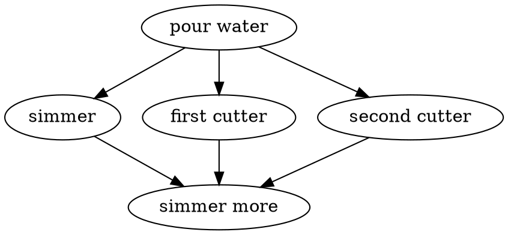
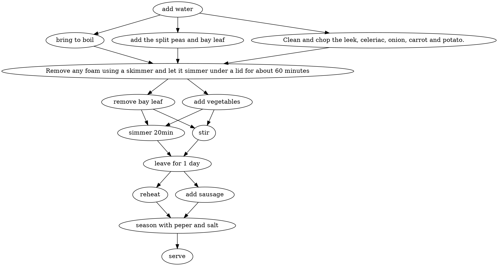
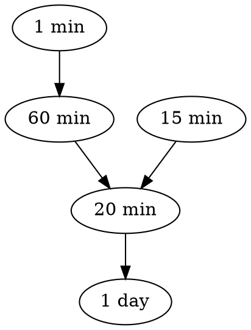
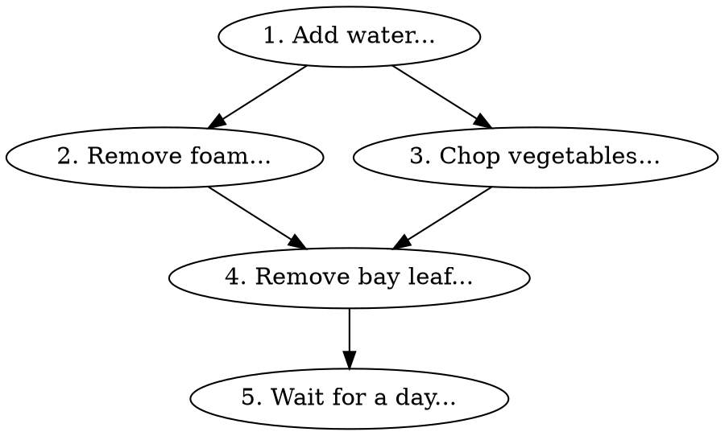
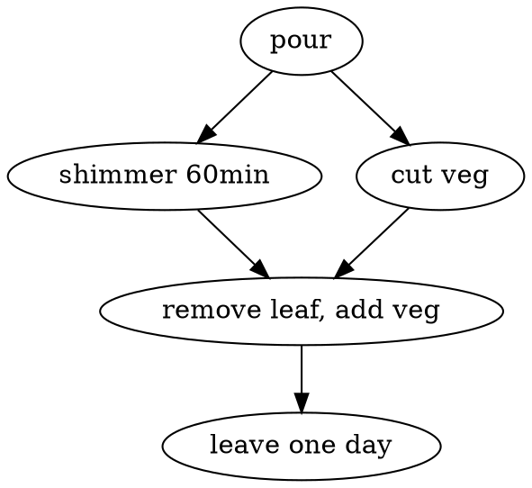
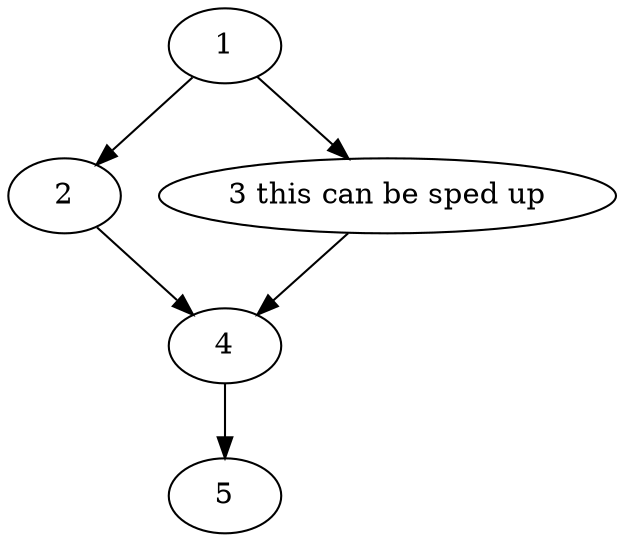
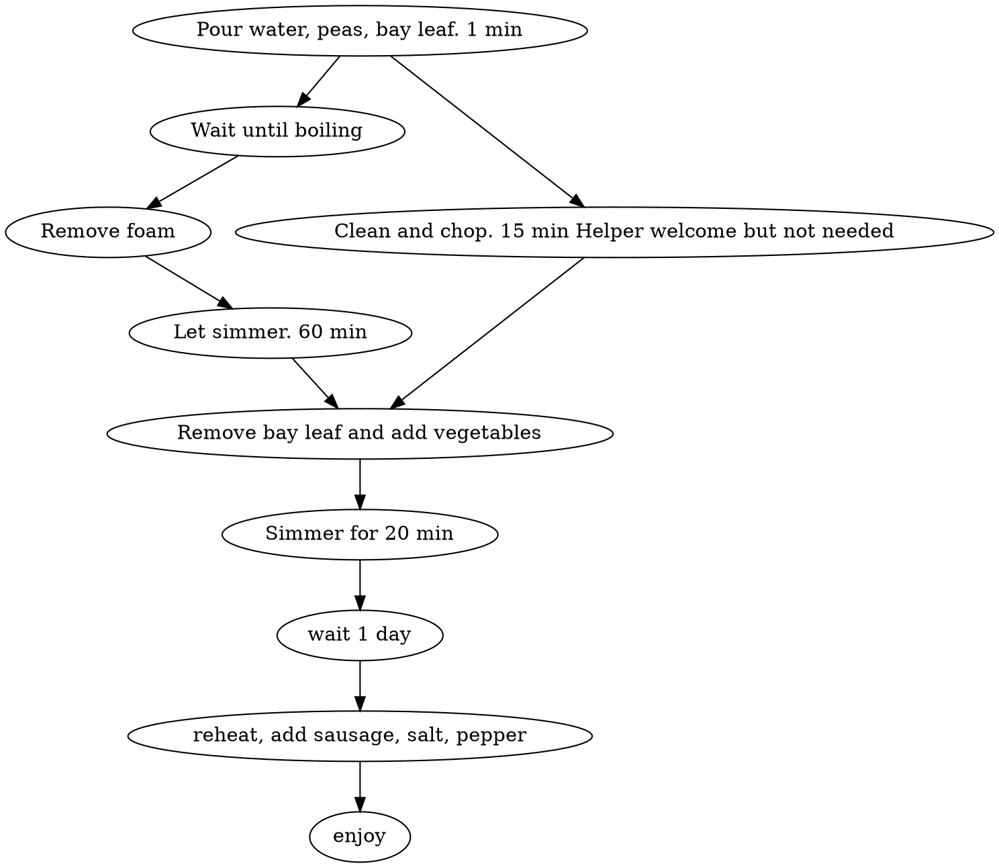

# Collaborative Document day 1
2023-07-04 Parallel Python Workshop.

Welcome to The Workshop Collaborative Document.

This Document is synchronized as you type, so that everyone viewing this page sees the same text. This allows you to collaborate seamlessly on documents.

----------------------------------------------------------------------------

This is the Document for today: [link](https://codimd.carpentries.org/ndMpRyXoSG-Z5P46p17vcA?both)

Collaborative Document day 1: [link](https://codimd.carpentries.org/ndMpRyXoSG-Z5P46p17vcA?both)

Collaborative Document day 2: [link](https://codimd.carpentries.org/pHojkc20QxisT7zC_9HDBg?both)


## 👮Code of Conduct

Participants are expected to follow these guidelines:
* Use welcoming and inclusive language.
* Be respectful of different viewpoints and experiences.
* Gracefully accept constructive criticism.
* Focus on what is best for the community.
* Show courtesy and respect towards other community members.
 
## ⚖️ License

All content is publicly available under the Creative Commons Attribution License: [creativecommons.org/licenses/by/4.0/](https://creativecommons.org/licenses/by/4.0/).

## 🙋Getting help

To ask a question, just raise your hand.

If you need help from a helper, place a pink post-it note on your laptop lid. A helper will come to assist you as soon as possible.

## 🖥 Workshop website

[link](https://esciencecenter-digital-skills.github.io/2023-07-04-ds-parallel/)

🛠 Setup

[link](https://esciencecenter-digital-skills.github.io/2023-07-04-ds-parallel/)

## 👩‍🏫👩‍💻🎓 Instructors

Johan Hidding, Leon Oostrum

## 🧑‍🙋 Helpers

Giordano Lipari, Ewan Cahen

## 👩‍💻👩‍💼👨‍🔬🧑‍🔬🧑‍🚀🧙‍♂️🔧 Roll Call
Name/ pronouns (optional) / job, role / social media (twitter, github, ...) / background or interests (optional) / city
:::success
This document has been anonymised
:::

## 🗓️ Agenda
<div class="row">
  <div class="col-md-6">
    <h3>Day 1</h3>
    <table class="table table-striped">
      <tr> <td>09:30</td>  <td>Welcome and icebreaker</td> </tr>
      <tr> <td>09:45</td>  <td>Introduction</td></tr>
      <tr> <td>10:30</td>  <td>**Break**</td></tr>
      <tr> <td>10:50</td>  <td>Measuring performance</td> </tr>
      <tr> <td>12:00</td>  <td>**Coffee break**</td> </tr>
      <tr> <td>12:15</td>  <td>Recap and Computing Pi</td> </tr>
      <tr> <td>12:45</td>  <td>Wrap-up</td> </tr>
      <tr> <td>13:00</td>  <td>**Lunch**</td></tr>
      <tr> <td>14:00</td>  <td>Computing Pi</td> </tr>
      <tr> <td>15:00</td>  <td>**Coffee break**</td> </tr>
      <tr> <td>15:15</td>  <td>Using Dask Array</td></tr>
      <tr> <td>16:00</td>  <td>**Tea break**</td> </tr>
      <tr> <td>16:15</td>  <td>Using Numba</td></tr>
      <tr> <td>16:45</td>  <td>Wrap-up</td> </tr>
      <tr> <td>17:00</td>  <td>END</td> </tr>
    </table>
  </div>
</div>


## 🏢 Location logistics
* Coffee and toilets are in the hallway, just outside of the classroom.
* If you leave the building, 
  be sure to be accompanied by someone from the escience center to let you back in through the groundfloor door
* For access to this floor you might need to ring the doorbell so someone can let you in
* In case of an emergency, you can exit our floor using the main staircase.
  Or follow green light signs at the ceiling to the emergency staircase.
* **Wifi**: Eduroam should work. Otherwise use the 'matrixbuilding' network, password should be printed out and available somewhere in the room.

## 🎓 Certificate of attendance
If you attend the full workshop you can request a certificate of attendance by emailing to training@esciencecenter.nl .

---
## 🔧 A. Exercises

### A1. Challenge: Parallelised Pea Soup

:::info
We have the following recipe:

1.  (1 min) Pour water into a soup pan, add the split peas and bay leaf, and bring it to boil.
2. (60 min) Remove any foam using a skimmer and let it simmer under a lid for about 60 minutes.
3. (15 min) Clean and chop the leek, celeriac, onion, carrot and potato.
4. (20 min) Remove the bay leaf, add the vegetables, and simmer for 20 more minutes. Stir the soup occasionally.
5.  (1 day) Leave the soup for one day. Re-heat before serving and add a sliced smoked sausage (vegetarian options are also welcome). Season with pepper and salt.

Imagine you're cooking alone.

- Can you identify potential for parallelisation in this recipe?
- And what if you are cooking with the help of a friend help? Is the soup done any faster?
- Draw a dependency diagram. Example below:


:::

:::success



 




1 person cooking:



:::

### A2. Challenge: Timeit
:::info
Use `timeit` to time the following snippets:

```python
[x**2 for x in range(100)]
```

```python
map(lambda x: x**2, range(100))
```

Can you explain the difference? How about the following

```python
for x in range(100):
    x**2
```

Is that faster than the first one? Why?
:::

### A3. Challenge: Implement the algorithm

:::info


Use only standard Python and the function `random.uniform`. The function should have the following interface:

```python
import random
def calc_pi(N):
    """Computes the value of pi using N random samples."""
    ...
    for i in range(N):
        # take a sample
        ...
    return ...
```

Also make sure to time your function!

**Work in your notebook and paste your code in a section below if you like. As we did for the dependency diagrams and the pea soup!**
:::

:::success

```python
import random
def calc_pi(N):
    """Computes the value of pi using N random samples."""
    ...
    x = []
    count = 0
    for i in range(N):
        # take a sample
        x = random.uniform(-1, 1)**2 + random.uniform(-1, 1)**2
        if x <= 1:
            count = count+1
        
    pi = 4*count/N
```

```python
import random
def calc_pi(nr_points):
    """Computes the value of pi using N random samples. How:
    Circle r=1 has area M = pi * r^2
    Square [-1,1] has area N = 4 r^2

    So M / N = pi / 4   =>   pi = 4 * M / N
    We approximate circle area by nr of points inside circle
    """
    nr_points = int(nr_points)

    counter_inside_circle = 0   # approximates area of circle M
    counter_outside_circle = 0
    
    for i in range(nr_points):
        # take a sample
        x = random.uniform(-1, 1)
        y = random.uniform(-1, 1)

        # check if it is inside the circle
        if x**2 + y**2 <= 1:
            # inside
            counter_inside_circle += 1
        else:
            # outside
            counter_outside_circle += 1

    assert counter_inside_circle + counter_outside_circle == nr_points, "smt wrong"

    # compute pi
    return 4 * counter_inside_circle / nr_points
```

```python
import random
def calc_pi(N):
    """Computes the value of pi using N random samples."""
    M = 0
    for i in range(N):
        x, y = random.uniform(-1, 1), random.uniform(-1, 1)
        distance = x**2 + y**2
        if distance <= 1:
            M += 1
    return 4 * M / N
```

```python
%%timeit

import random

def calc_pi(N):
    """Computes the value of pi using N random samples."""
            
    pi = sum([ random.random()**2 + random.random()**2 < 1 for i in range(N) ]) / N * 4
            
    return pi

calc_pi(100)
```

```python
def calc_pi(N):
    """Computes the value of pi using N random samples."""
    M = 0
    for i in range(N):
        x = random.uniform(0, 1)
        y = random.uniform(0, 1)
        distance = x**2 + y**2
        
        if distance <= 1:
            M += 1
    pi_estimate = 4 * M / N
    return pi_estimate
```


```python
import random

def calc_pi(N):
    """Computes the value of pi using N random samples."""

    area_circle = 0
    for i in range(N):
        # take a sample
        x = random.uniform(0,1)
        y = random.uniform(0,1)
        if (x**2 + y**2) < 1.:
            area_circle +=1

    return area_circle/N*4
```
:::

### A4. Challenge: Daskify

:::info
Write `calc_pi_dask` to make the Numpy version parallel. Compare speed and memory performance with
the Numpy version. NB: Remember that dask.array mimics the numpy API.

**Please do not share your solution for this exercise** 
:::

### A5. Challenge: Numbify `calc_pi`

:::info
Create a Numba version of `calc_pi`. Time it.

**Work in your notebook and paste your code in a section below if you like. As we did for the dependency diagrams and the pea soup!**
:::

:::success

```python
import random
@nb.jit
def calc_pi_numba(N):
    """Computes the value of pi using N random samples."""
    N = int(N)

    counter_inside_circle = 0   # approximates area of circle M
    
    for i in range(N):
        # take a sample
        x = random.uniform(-1, 1)
        y = random.uniform(-1, 1)

        # check if it is inside the circle
        if x**2 + y**2 <= 1:
            # inside
            counter_inside_circle += 1

    # compute pi
    return 4 * counter_inside_circle / N

%timeit calc_pi_numba(1e6) # 7.19 microsecond
```


```python
@nb.jit
def calc_pi_numba(N):
            
    pi = sum([ random.random()**2 + random.random()**2 < 1 for i in range(N) ]) / N * 4
            
    return pi
```

```python
@nb.jit
def calc_pi_numba(N):
    """Computes the value of pi using N random samples."""
    M = 0
    for i in range(N):
        x, y = random.uniform(-1, 1), random.uniform(-1, 1)
        distance = x**2 + y**2
        if distance < 1:
            M += 1
    return 4 * M / N
```
:::

### A6. Try threading on a numpy function

:::info 
Many Numpy functions unlock the GIL. Try to sort two randomly generated arrays using numpy.sort in parallel.

**RULES**
1. Work in your notebook: use **TWO THREADS** and **n=10^6** for the sake of comparability, please. 
2. Paste in the table how much timeyour baseline and enhanced code took. 
3. PLEASE WRITE IN THE CELLS MADE AVAILABLE. The markdown editor is rather touchy.
:::

:::success
| who        | numpy function | baseline wall time [ms] | enhanced wall time [ms] |  
|:---------- | --------------:|:----------------------- |:----------------------- | 
|        |           clip | 96                      | 107                     |                                                    |                      |
|        |         cumsum | 42                      | 74                      |                                                    |                      |
|     |       gradient | 4.4                     | 5.38                    |                                                    |                      |
|        |        np.sort | 63.4                    | 41.4                    |                                                    |                      |
|        |      power (2) | 187                     | 215                     |                                                    |                      |
|     |           sort | 0.614 [N=1000]          | 3.                      |                                                    |                      |
|     |           sort | 0.614 [N=1000]          | 3.03 [N=1000]           |                                                    |                      |
|  |    sort[10**6] | 152                     | 80.6                    |                                                    |                      |
|    |    sort[10**6] | 164                     | 220                     | 
|    |    sort[10**6] | 164                     | 220                     |                                                    |                      |
|     |    sort[10**6] | 71.8                    | 80.5                    |
|     |    sort[10**6] | 75.2                    | 80.5                    |                                                    |                      |
|     |           sort | 170                     |                         |                                                    |                      |
|  |           sort | 178                     | 121                     |                                                    |                      |
|        |           sort | 54.9                    | 48.8                    |                                                    |                      |
|  |           sort | 67.2                    | 62.7                    |                                                    |                      |
|        |           sort | 99.3                    | 101                     |
|        |           sort | 99.3                    | 101                     |                                                    |                      |
|  | sort (N=10**8) | 67.2                    | 62.7                    |                                                    |                      |
|        |           sqrt | 21                      | 55                      |                                                    |                      |
|        |            sum | 9.5                     | 8.7                     |                                                    |                      |
:::

#### A7. Challenge. Reimplement `calc_pi` with multiple processes and a queues

:::info
Reimplement `calc_pi` with multiple processes and use a queue to return the function result
:::


---


# 🧠 B. Collaborative Notes

:::warning
**Full disclosure**[](https://)
These notes are being updated as promptly as possible, _wi-fi permitting_.  
Please bear with us if the notes lag behind a bit.
:::

### 1. Introduction

#### 1.1 Introduction to the eScience Centre

#### 1.2 Parallel Python intri

:::warning
Warning. We do not deal with **distributed programming** in this course
:::

:::warning
Warning. Python is an **interpreted** programming language. So it cannot be as fast as a **compiled** programming languages.
:::

:::info
Info. Be open and consider also whether other options than Python are viable. For example, is Julia something for you?
:::

:::success
#### Poll: why are you attending this workshop?

- : Want my algorithms to run faster. Need to approximate Maximum Independent Set Problem.
- : use an existing parallelized model in python for sea level; learn more about parallel programming to be able to debug
- : Trying to find out if I can speed up part of my code by making it parallel (it is currently just numpy). Code calculates spectra of exoplanet atmospheres by basically doing an integral over a 4D array.
- : speeding up text preprocessing of large datasets
- : learn parallel programming systematically, tackle problems, parallel process remote sensing data
- : I want to provide consultanty to researchers about parallel programming implementations and parallelize software for personal research projects;
- : I'm trying to integrate a system of partial differential equations.
- : I like the notion of parallel programming but I have not had the chance to do it in python and I am too lazy to do it on my own from scratch, so workshop sounded like a nice idea. 
- : how to parallelize scripts on a cluster (not only Python, but also R scripts) so they run faster.
- : For a machine learning project I need to work with a very large amount of satellite data. For the training, but especially for the operational implementation I need to do a lot of aggregating and computations on different observations on different days, which are all huge files. Different aspects of this project have a large potential to be parallelized.
- : faster programming, data cleaning in parallel so that it goes faster and more efficiently
- : computing multiple partial differential equations in parallel where communication is needed after every iteration for computing new boundary conditions
- : clean data faster when new data comes in and you have to run the script again
- : 3D hydrodynamic simulations in athena++, it is already running parallel, but I want to understand it better in case I need to make adjustments in the future.

:::

:::info
Info. Python is a language using **imperative programming**. 
:::

#### 1.3 Adding up numbers

```python
# vanilla baseline
a = list(range(10))

total = 0
for x in  a:
    total += x
    
print(total)

# example of chuncking the input manually
a_lower = a[:5]
a_higher = a[5:]

total = sum(a_lower) + sum(a_higher)

print(total)
```

```python
# example of embarrassing parallel task
[x**2 for x in a]
```
:::success
#### Poll: which tasks are easy and hard to parallelize in your domain?
- Johan:
  - easy:
  - hard:
- : 
    - easy: filtering a text dataset based on keywords
    - hard: 
- : easy (?) -> parallelizing the output fo a fully connected layer in neural networks. hard -> Parallelizing a convolutional neural network on your own. Fortunately, Python has frameworks that do this for me :-)
- : 
    - easy: downloading and pre-processing of satellite observations on different days and different locations (both in space and time). 
    - hard: performing computations that require observations of the same location on different times as input.
- : cleaning different columns in a Pandas DataFrame. Different columns (almost always) do not depend on each other so you can just work with them in parallel
- : easy -> solving multiple times the same set of differential equations with different input parameters. Difficult -> solving a partial differential equation in parallel 
- : 
    - Easy: I have a for-loop somewhere. 
    - Hard: Part of my code iteratively calls another C++ code (from within Python) to converge upon a solution.
- :
    - easy: solving hydrodynamic equations and share results before the next iteration step
    - hard: 
- : 
  - easy: solve same equation (e.g. carbon storage by plants) in different independent grid cells on land
  - hard: solve fluid dynamic equation in ocean grid cells, which need fluxes between them every time step
- : easy: project im working on now. Every step of the data cleaning process is not dependent on anything else. hard: statistical calculations that do depent on eachother. 
- : 
    - Easy: Calculation algorithm performance numerically.
    - Hard: Stochastic processes which are not Markov.
- : 
    - easy: data reduction of multiple satellite observations;
    - hard (impossible?): improving efficiency of time series analysis algorithms (FFT, wavelet);
- :
    - Easy: loop over a set of files where the same analysis has to be peformed. 
    - Hard: run two sequential simulations which depend open each other (output 1 needed as input 2). 
- : 
  - easy: remote sensing images are usually large, which will be cut into tiles to be processed, so these tiles can be naturally distributed to different kernels to be processed
  - hard: polygons, time series analysis of pixels

#### Lesson continues below. Please write above this.
:::

#### 1.4 Peas on Earth

:::danger
**Migration notice**
The exercise is now placed above in the section **Exercises**, at https://codimd.carpentries.org/ndMpRyXoSG-Z5P46p17vcA?both#A1-Challenge-Parallelised-Pea-Soup

**Please work out your solution there**
:::

:::info
#### We resumed at 10:50
:::

### 2. Benchmarking

#### 2.1 The System Monitor, Numpy, and Dask

```python
# python
import numpy as np
result = np.arange(10**7).sum()
# the alternative below to avoid overflows and flawed arithmetics
# result = np.arange(10**7, dtype=np.int64).sum()  print(result)

# dask.array
import dask.array as da
work = da.arange(10**7).sum()
type(work)  # it is still an array!
work.compute()  # the result is computed and printed out
```

#### 2.2 Timing

:::warning
**Magics notations in these notes**
The magics %% and % apply to Jupyter (iPython) cells and lines. Unless otherwise stated, the snippets below report what has been typed in a JupyterLab cell.
:::

```python
%%time  # new feature
np.arange(10**9).sum()
```

```python
%%time
da.arange(10**9).sum().compute()
```

```python
%%time
da.arange(10**9, chunks=10**6).sum().compute()  # 1000 jobs of size 10^6
```

```python
%%timeit  # new feature
np.arange(10**7).sum()
```

```python
%%timeit
da.arange(10**7,chunks=10**5).sum().compute()  # 100 jobs
```

```python
%%timeit
da.arange(10**8,chunks=10**6).sum().compute()  # 100 jobs
```

:::info
**Exercise** at https://codimd.carpentries.org/ndMpRyXoSG-Z5P46p17vcA?both#A2-Challenge-Timeit-line-276
:::


#### 2.3 Memory profiling

```python
from memory_profiler import memory_usage

# define functions to use memory_usage on
def sum_with_numpy():
    np.arange(10**8).sum()
    
def sum_with_dask():
    # please play around with chunks (see above)
    work = da.arange(10**8).sum()
    work.compute()
    
# please play around with interval=0.01|0.001
memory_numpy = memory_usage(sum_with_numpy, interval=0.001) 
memory_dask = memory_usage(sum_with_dask, interval=0.001)

# visualize
from matplotlib import pyplot as plt
plt.plot(memory_numpy, label='numpy')
plt.plot(memory_dask, label='dask.array')
plt.xlabel('Interval counter')
plt.ylabel('Memory [MiB]')
plt.legend()
plt.show()
```

#### 2.4 How many cores do I have?

```python
import psutil
psutil.cpu_count(logical=True)  # logical cores
psutil.cpu_count(logical=False)  # physical cores
```

```python
# sensitivity of timing to the numbers of cores
x = []
for n in range(1, 9):
    # line magic with % + one run with -r 1 + -o save output to variable 
    time_taken = %timeit -r 1 -o da.arange(5*10**7).sum().compute(num_workers=n)
    x.append(time_taken.average)

# visualize (with pandas, because it looks cool)
import pandas as pd
data = pd.DataFrame({'n': range(1,9), 't': x})
data.set_index('n').plot(title='test')    ```
```
:::info
#### We resumed at 12:15
:::

### 3. Computing $\pi$

:::info
**Exercise** above in this document at https://codimd.carpentries.org/ndMpRyXoSG-Z5P46p17vcA?both#A3-Challenge-Implement-the-algorithm
:::

#### 3.1 Baseline with vanilla Python

```python
import random
def calc_pi(N):
    """ docstrings coming soon"""
    M =0
    for i in range(N):
        x = random.uniform(-1, 1)
        y = random.uniform(-1, 1)
        if x**2 + y**2 < 1.0:
            M += 1
    return 4 * M / N
```

```python
# baseline timing
%timeit calc_pi(10**6)
```
#### 3.2 Vectorized approach with Numpy

:::warning
Use the same N for each test, for the sake of comparison
:::
```python
import numpy as np
def calc_pi_numpy(N):
    points = np.random.uniform(-1, 1, (2, N))  # one big object is stored in memory
    M = np.count_nonzero((points**2).sum(axis=0) < 1.0) # in Py zero is false
    return 4 * M / N
    
%timeit calc_pi_numpy(10**6)  
```

#### 3.3 Chunked approach with `dask.array`

:::info
**Exercise** above in this document at line https://codimd.carpentries.org/ndMpRyXoSG-Z5P46p17vcA?both#A4-Challenge-Daskify
:::

```python
import dask.array as da

def calc_pi_dask(N):
    points = da.random.uniform(-1, 1, (2, N))  # one big object is stored in memory
    M = da.count_nonzero((points**2).sum(axis=0) < 1.0) # in Py zero is false
    return 4 * M / N

%timeit calc_pi_dask(10**6).compute() 
```
```python
# spot the difference!
type(calc_pi_dask(10**6).compute()
type(calc_pi_dask(10**6))
calc_pi_dask(10**6)
```

:::warning
Do not forget the method compute()! Use compute() only at the point of using the final results and not in the function body, for sake of efficiency 
:::

```python
# memory
from memory_profiler import memory_usage

memory_usage_numpy = memory_usage(lambda: calc_pi_numpy(10**6), interval=0.01)
memory_usage_dask = memory_usage(lambda: calc_pi_dask(10**6), interval=0.01)
# Explainer. lambda functions are a workaround to feed to memory_usage() a function *and* its arguments

# visualize```
from matplotlib import pyplot as plt
plt.plot(memory_usage_numpy, label='numpy')
plt.plot(memory_usage_dask, label='dask.array')
plt.xlabel('Interval counter')
plt.ylabel('Memory [MiB]')
plt.legend()
plt.show()
```

:::info
#### We resumed at 14:00
:::

#### 3.4 Numba, another external library

```python
import numba as nb

# vanilla Python function
@nb.jit  # this a decorator
def sum_range_numba(a):
    x = 0
    for i in range(a):
        x += i
    return x

# Explain a decorator: sum_range_numba = nb.jit(sum_range)
# Expect a deprecation warning, not applicable for the current numba version
```

#### 3.5 Compare acceleration strategies
```python
%timeit sum(range(10**8))  # this range generates numbers one at a time

%timeit np.arange(10**8).sum()  # this creates an array

%timeit sum_range_numba(10**8)  # expect one-off warning
%timeit sum_range_numba(10**8)  # the machine code has been compiled and is reused
```

:::danger
**Unexpected pass!**
Instructors need to review this bit of the course.

    %timeit sum_range_numba(10.**8)  # we expected this to fail...
:::

:::info
**Exercise** above in this document at line https://codimd.carpentries.org/ndMpRyXoSG-Z5P46p17vcA?both#A5-Challenge-Numbify-calc_pi

```python
@nb.jit
def calc_pi_numba(N):
    M = 0
    for i in range (N):
        # NB you don't use numpy but standard libraries
        x = random.uniform(-1, 1)
        y = random.uniform(-1, 1)
        if x**2 + y**2 < 1:
            M += 1
    return 4 * M / N

%time calc_pi_numba(10**6)  # jit
%time calc_pi(10**6)  # naive baseline
```
:::

### 4. Threads and processes

```python
n = 10**6  # set the problem size for all sections
```

#### 4.1 Vanilla baseline

```python
import random

def calc_pi(N):
    M = 0  # counter of all valid points
    print('Start')
    for i in range(N):
        # coordinates of points
        x = random.uniform(-1, 1)
        y = random.uniform(-1, 1)
        # increase valid points conditionally
        if x**2 + y**2 < 1.0:
            M += 1
    print('End')
    return 4 * M/N

%timeit calc_pi(n)
```

#### 4.2 Multiple threads (on the cores we have)

```python
from threading import Thread
```

```python
%%time 
# the bother of threading entails creating and destroying the threads, so we time it all

# define
t1 = Thread(target=calc_pi, arg=(n,))
t2 = Thread(target=calc_pi, arg=(n,))

# start
t1.start()
t2.start()

# terminate
t1.join()
t2.join()

# the resulting timing must be expained with the Global Interpreter Lock (GIL)
```

#### 4.3 Numba without GIL


```python
import numba as nb

@nb.jit(nopython=True, nogil=True)
def calc_pi_numba_nogil(N):
    M = 0
    # print('Start')
    for i in range(N):
        x = random.uniform(-1, 1)
        y = random.uniform(-1, 1)
        if x**2 + y**2 < 1:
            M += 1
    # print('End')
    return 4 * M / N

# Usage note: a bit pointless to use @nb.njt for nopython=True

%timeit calc_pi_numba_nogil(n)
```
:::warning
Comment out `print()` statements because you ask `nopython=True`; else an error is thrown, rightfully since `print()` **is** Python
:::

```python
%%time 

# define
t1 = Thread(target=calc_numba_pi, arg=(n,))
t2 = Thread(target=calc_numba_pi, arg=(n,))

# start
t1.start()
t2.start()

# terminate
t1.join()
t2.join()
```

:::info
##### We resumed at 15:15
:::

#### 4.4 Title
:::info
**Exercise** above in this document at line https://codimd.carpentries.org/ndMpRyXoSG-Z5P46p17vcA?both#A6-Try-threading-on-a-numpy-function
:::


#### 4.5 Processes

```python
from multiprocessing import Process
from calc_pi import calc_pi # saved vanilla function calc_pi() in file calc_pi.py (saves you an error!)

if __name__ == '__main__':
    
    print('True')
    
    n = 10**6  # we had set this before too
    p1 = Process(target=calc_pi, args=(n,))
    p2 = Process(target=calc_pi, args=(n,))

    p1.start()
    p2.start()

    p1.join()
    p2.join()    
```

#### 4.6 The context and queues

```python
import multiprocessing as mp
ctx = mp.get_context()
ctx.Process
# create a queue for the context, where processes can fetch data from
queue = ctx.Queue()  # instantiate object
queue.put(20)  # fill
queue.put('fish') # fill
queue.get()  # returns 5
queue.get()  # returns fish
```
:::warning
**Issues between queues and Jupyter (not with Python scripts)**
`queue.get()  # one more get() on an empty queue `  
Queue is empty. Queues are _blocking_ in nature: they wait until you put something into it. Note the \[\*\] in Jupyter; Jupyter gets stuck, though. Stop the kernel and pre-empt this incident.
:::

:::info
**Exercise** Above in this document, at line https://codimd.carpentries.org/ndMpRyXoSG-Z5P46p17vcA?both#A7-Challenge-Reimplement-calc_pi-with-multiple-processes-and-a-queues 
:::

:::info
#### Worked until 16:15, then resumed at 16:30
:::

The following is a python script `*.py`, not a Jupyter cell! We call it from a terminal.
```python
import random
import multiprocessing as mp

def calc_pi(N):
    M = 0
    # print('Start')
    for i in range(N):
        x = random.uniform(-1, 1)
        y = random.uniform(-1, 1)
        if x**2 + y**2 < 1:
            M += 1
        value_of_pi = 4 * M / N
    # print('End')
    return value_of_pi

def calc_pi_queue(n,queue):
    value_of_pi = calc_pi(n)
    queue.put(value_of_pi)
    
if __name__ == '__main__':
    ctx = mp.get_context()
    queue = ctx.Queue()
    n = 5 * 10**6
    
    # create two processes
    p1 = ctx.Process(target=calc_pi_queue, args=(n, queue))
    p2 = ctx.Process(target=calc_pi_queue, args=(n, queue))
    
    p1.start()
    p2.start()
    
    # this is meant to run as a Python script
    # so Jupyter will not spoil the party
    # the queue keeps on checking until calc_pi_queue() puts something in it
    # you could place these two lines after the join
    for i in range(2):
        print(queue.get(i))
    
    p1.join()
    p2.join()
```

#### 4.7 The context and pools

This is a script `calc_pi_pool.py`, not a Jupyter cell! Run it in a terminal.

```python
import mutiprocessing as mp
from timeit import timeit
from intertools import repeat # new tool of convenience
from calc_pi import calc_pi  # vanilla python

def submit(ctx, N):
    with ctx.Pool() as pool:  # trust what Python does
        result = pool.starmap(calc_pi, repeat((N,), 4)) # call 4 functions
        print(result) 

if __name__ == '__main__':
    ctx = mp.get_context()
    for i in (1_000, 100_000, 10_000_000):
        res = timeit(lamda: submit(ctx,i), number =5) # number is the number of reoeats
        print(i, res)
        print()

# timing information will tell you if work must have been done in parallel         
```

---
## Feedback

### :-1: things that could be improved
:::danger
* Clearer explanation of what a CPU, core, thread, node is?
* Using images to explain.
* Better also provide summary of concepts apart from examples
* add a solution for every exercise
* start was a bit slow, rest a bit too fast
* It would be nice to have some visuals as an introduction of the different topics before going to the exercises
* Fruit for lunch and breaks, not just sugary cookies
* More straightforward introduction into the esciencecenter
* (The instructors did not use the collaborative document for day 1 listed in the Plannig Document)
:::

### :+1: things I liked

:::success
* I actually liked today, started a bit slow but that also depends on the introduction side of the course. As time passed it got more and more interesting. I will just need to sit closer to a monitor tomorrow!
* The exercise and examples are really helpful
* The tempo was not too fast
* Atmosphere
* Good balance between listening and doing
* Good amount of breaks
:::

## 📚 Resources

- [Numpy Sort](https://numpy.org/doc/1.25/reference/generated/numpy.sort.html#numpy.sort)

---

